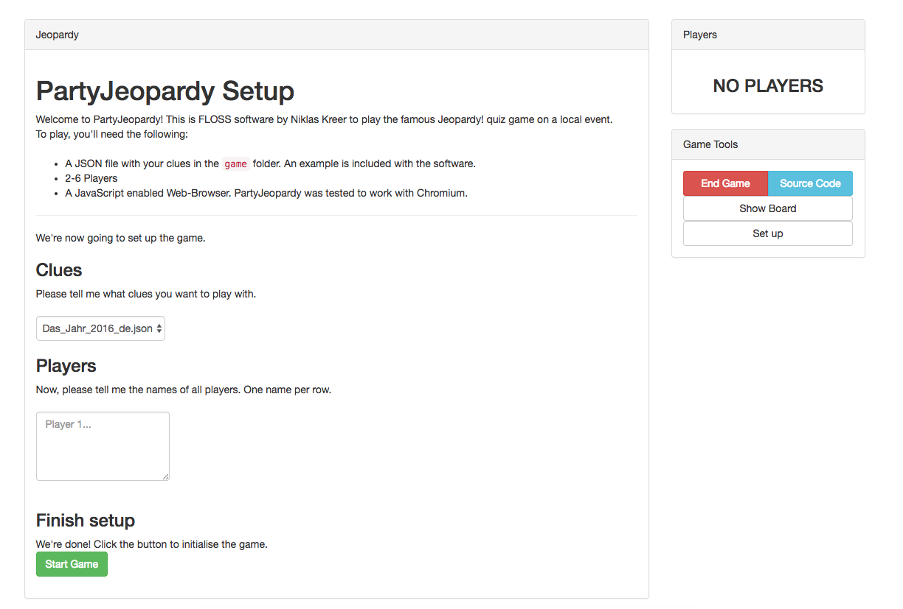
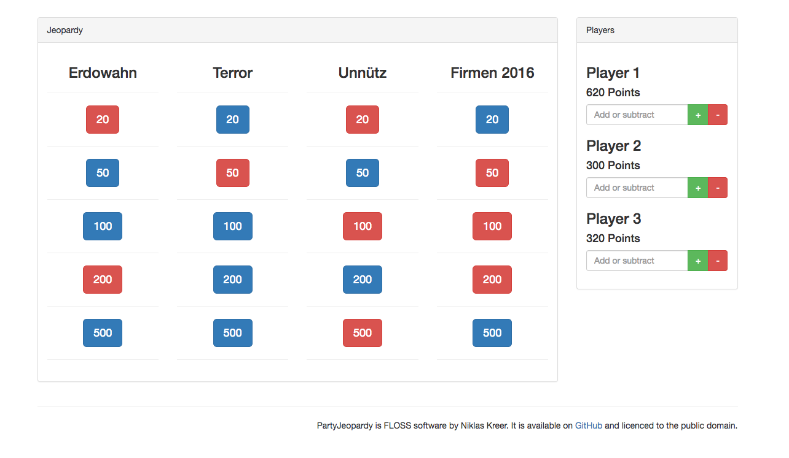
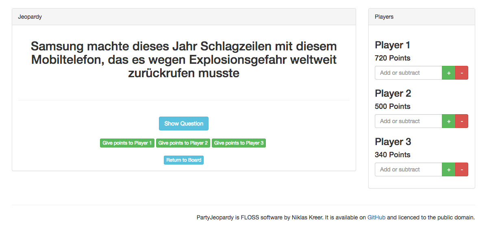

# PartyJeopardy

PartyJeopardy is a hacky Jeopardy! game for small, local events.
While making this, I focused on functionality and not on code quality and style. Hack at your own risk.

### Dependencies

* Twitter Bootstrap (is included, MIT licence)
* A JSON-Object containing questions and answers (example in the German language is included)
* A local Web-Server (to install, clone the repo to its directory)

**Warning:** This does not come with any protection whatsoever. **DO NOT** upload this to a public web server!
Luckily, PHP has one already built-in! Run `php -S localhost:9000` in your CLI and navigate your browser to the same address.

### Game preparation

To play, you need a JSON file with your own clues. An example is included with the software. 
Put it into the `games/` folder, navigate to your web-directory and follow the setup instructions on your screen. It's really simple!

### Getting clues

There's a small utility included which downloads random jeopardy categories from jservice.io and saves them to a file which can be used by PartyJeopardy! Alternatively, you could just make your own! The json format you need to use for your clue file is

```
"boards": [
	{
		"categories": {
			"category": [
				{
					"question": "required",
					"answer": "required",
					"image": "optional"
				},
				...
			],
			...
		}
	},
	...
]
```

### Information

This project is in no way affiliated with Jeopardy!, its producers or distributors. 
It is a stand-alone project based on the idea of the Jeopady! game show created solely for entertainment purposes. 

### Licence

This code (except otherwise noted in the files) is published and released to the Public Domain, so anyone can benefit from my work without any restrictions.

### Screenshots

Setup:


Clue board:


Clue detail:
